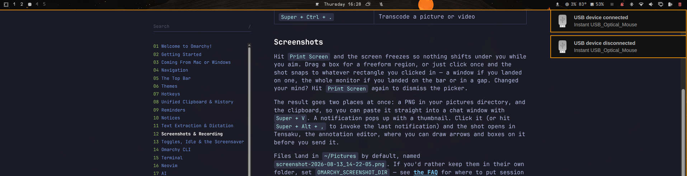

# Notification Sounds

The KDE **Ocean** sound theme, wired into the whole Omarchy desktop — not just notifications.

Every desktop notification is voiced according to the freedesktop spec, and the events that never *produce* a notification get a sound too: volume keys, login and logout, the AC cable, the battery, USB and bluetooth hotplug, the network coming and going. All 45 Ocean samples have a trigger, and every one of them goes quiet together when you mute the bar widget or switch on Do Not Disturb.

Sounds ship inside the plugin, so there is nothing else to install.



## Why you will love it

- **Genuinely system-wide.** One mute switch covers notifications, keybindings, hooks and background watchers alike.
- **Lightweight by design.** A ~3 MB folder of Ocean sounds, one QML service, and a few hundred lines of bash — no browser, no Electron.
- **Made for Omarchy.** It reads the `omarchy-glyph` hint that first-party Omarchy notifications already carry, so a reminder firing, a download finishing and a crash being captured each get their own sound without patching a single `omarchy-*` script.
- **Respects your focus.** Do Not Disturb silences the whole system, not just toasts.
- **Speaks your apps' language.** Senders use standard `category` and `sound-name` hints; the plugin does the rest.

## What makes a sound

Four layers, checked in order, then urgency as the backstop.

### 1. Notifications

| Signal | Example | Sound |
|---|---|---|
| `sound-name` hint | anything the sender picks | that sound, if the theme has it |
| `suppress-sound` hint | `true` | silence |
| `category` sub-event | `im.sent`, `transfer.failed`, `media.error` | the specific sound |
| any other `*error` | `network.error` | `dialog-error` |
| `category` base | `im`, `transfer`, `call` | the category sound |
| `omarchy-glyph` hint | reminder, download, crash, game install | see below |
| notification icon | `battery-caution`, `dialog-password` | the matching sound |
| urgency | low / normal / critical | `message-highlight` / `dialog-information` / `dialog-error-critical` |

Sub-events beat the generic error rule, which in turn beats base categories — so `media.error` is a media error, `network.error` is still an error, and plain `network` is just news.

Matching on the glyph is what catches Omarchy's own notifications, which carry no category at all. Where Omarchy reuses one glyph for both halves of an outcome — 󰒊 is both "Sent to $name" and, at critical urgency, "Could not send to $name" — the rule splits on urgency so a failure never chimes like a success.

### 2. Keybindings

Volume up, volume down, mute and their precise ALT variants play `audio-volume-change`, throttled so a held key does not stack a dozen copies. PRINT plays `button-pressed` **after** a successful capture, so a cancelled region picker stays silent.

### 3. Hooks

| Hook | Sound |
|---|---|
| `post-boot` | `desktop-login` |
| `theme-set` | `completion-rotation` |
| `font-set` | `completion-partial` |
| `post-update` | `complete-media-burn` |

There is deliberately **no** `battery-low` hook: Omarchy already sends a low-battery notification, and the plugin sounds it from its `battery-caution` icon. A hook would play a second sound over the top of the first.

### 4. Background watchers

`omarchy-sound-watch` (a systemd user service) covers what nothing else reports:

| Event | Sound |
|---|---|
| AC connected / disconnected | `power-plug` / `power-unplug` |
| battery full | `battery-full` |
| battery critical | `battery-caution` (with a toast) |
| network online / offline | `service-login` / `service-logout` |
| bluetooth connect / disconnect | `device-added` / `device-removed` |
| USB connect / disconnect | `device-added` / `device-removed` |

USB toasts name the kind of device, not just the vendor string: *Mouse connected*, *Keyboard connected*, *USB drive connected*, *Webcam connected*. The type comes from `ID_USB_INTERFACES`, the list of USB interface classes udev publishes for the device, which is the only thing that actually says what a device *is* — a marketing name in `ID_MODEL` does not. Composite devices claim several interfaces at once, so the most informative one wins: a webcam that also exposes a microphone is a webcam. Root hubs are skipped, since nobody plugged those in.

Check it against your own hardware without unplugging anything:

```bash
bash tools/test-device-alert.sh add
```

Each watcher blocks on a real event source (udev, `nmcli monitor`, D-Bus) and re-reads the actual state when woken, with a slow poll behind it so a missed event self-corrects instead of wedging the watcher.

Logout is handled separately by `omarchy-sound-session`, whose `ExecStop` plays `desktop-logout` synchronously and is ordered before PipeWire shuts down, so the chime actually reaches the speakers.

Turn individual watchers off in `~/.config/omarchy/sound-events.conf`.

## The `omarchy-sound` command

```bash
omarchy-sound power-plug              # play one sound
omarchy-sound notify message-new-email "Inbox" "1 new message"
make -j8; omarchy-sound outcome $?    # success / failure chime
omarchy-sound status                  # what is wired up, and whether it is audible
omarchy-sound test                    # play all 45 in order
omarchy-sound list
```

`play` makes noise with no toast; `notify` raises a real notification carrying a `sound-name` hint, so the shell plugin stays the single audio path and one event can never produce two overlapping sounds. Both honour the mute toggle and Do Not Disturb.

Check that nothing has lost its trigger:

```bash
python3 tools/audit-coverage.py     # 45/45 sounds have at least one automatic trigger
bash tools/test-power-transitions.sh
```

## Sounds are bundled

The full Ocean sound set lives in the plugin's `sounds/` folder—no system package needed. If you prefer to follow your system theme instead, install it with `omarchy pkg add ocean-sound-theme` and delete the `sounds/` folder; the plugin then falls back to `/usr/share/sounds/ocean/stereo`.

## Install

```bash
git clone https://github.com/fab679/virtuoso.notification-sounds.git
cd virtuoso.notification-sounds && ./install.sh
```

That one command copies the plugin into `~/.config/omarchy/plugins/`, enables it in `shell.json`, puts the speaker glyph at the far right of your bar, adds the launcher-menu toggle, installs the `omarchy-sound` CLI, the hooks, the keybindings, the USB alert service and the event watchers, validates, and restarts the shell. It is idempotent — safe to re-run whenever you pull a new version.

Want notifications only, with none of the system-wide wiring? `./install.sh --no-system`. Skip just the USB alerts with `./install.sh --no-usb`.

Requires Omarchy and PipeWire/PulseAudio with `pw-play` (`pipewire-utils`):

```bash
omarchy pkg add pipewire-utils
```

Prefer the official path?

```bash
omarchy plugin add https://github.com/fab679/virtuoso.notification-sounds.git --enable
```

then run `~/.config/omarchy/plugins/virtuoso.notification-sounds/install.sh` once to place the bar widget, menu toggle, CLI, hooks, keybindings and watchers.

## Toggle

- **Bar widget** (speaker glyph, far right): click to mute or unmute.
- **Menu**: Trigger → Notification Sounds (shows ✓ when on).
- **Terminal**: `omarchy-shell virtuoso.notification-sounds toggle`

Unmuting plays the Ocean theme's own demo sample, so the click that turns sound back on also confirms the audio path works. Muting stays silent, which is the point of muting.

The state persists in `~/.local/state/omarchy/notification-sounds.json`, and `omarchy-sound` reads that same file — which is why one toggle covers keybindings, hooks and watchers too.

## Remove

While the plugin is still installed:

```bash
~/.config/omarchy/plugins/virtuoso.notification-sounds/uninstall.sh
```

That removes the plugin folder, its `shell.json` entries, the launcher-menu toggle, the CLI, the hooks, the event config, the three user units, and the keybinding block it appended to `~/.config/hypr/bindings.lua` (backing the file up first), then restarts the shell.

## Credits

Sound effects are from the KDE Ocean theme (CC BY-SA 4.0); the `.license` files ship alongside them in `sounds/`. Playback uses `pw-play`.

Omarchy Notification Sounds is an independent project and is not affiliated with KDE. Ocean is a trademark of KDE e.V.

Licensed under the MIT License.